
<h1 align="center">基于的乐享田园系统</h1>

## 简介
乐享田园系统：系统基于Spring Boot开发，包含管理员、农民、用户角色，主要功能包括土地租赁管理、农民信息管理、种植活动记录、用户建议反馈和订单管理，提供用户友好的互动和高效的信息管理体验。    --计算机毕业设计源码；毕设源码；java毕业设计源码

## 联系方式

<h3 align="center">获取完整代码与数据库文件 + 微信：deepguan QQ: 86050149 QQ群: 783742310</h3>

<h3 align="center">可帮忙远程部署 包运行成功！提供远程部署、修改代码、设计文档指导、代码讲解等服务！</h3>

## 功能介绍（完整见运行截图）
管理员：管理员可以通过系统登录、注册和退出功能进行身份验证。管理界面提供个人中心信息维护、农民管理、土地管理、用户管理等功能，通过左侧功能菜单选择不同模块进行操作。主要管理功能包括用户建议的查看与处理、土地类型和订单的管理，以及种植与农田活动的监督。管理员还可以查看和回复土地评论，实时监控土地租赁状态，维护系统正常运行。

农民：农民用户可以通过登录和注册功能访问系统，查看个人信息并进行更新。系统提供农民信用类型评估，并展示其他农民用户以促进交流。农民可以管理和查看其土地详情，上传与土地相关的图片和视频。通过该平台，农民能够发布对土地的评价与建议，并与管理员或其他用户交流，提升他们在系统中的互动性。

用户：用户在系统中可以注册和登录，完成个人中心信息的维护和查看。用户主要功能包括查看和管理土地租赁订单，了解土地详细信息如名称、位置、状态等。系统允许用户对土地进行评论，查看其他用户评论，并参与土地租赁续租等操作。用户建议和反馈可以在建议管理页面提交，帮助改善平台服务。

游客：游客角色的主要功能是浏览系统展示的乐享田园信息，包括土地名称、照片、类型等概况。虽然游客无法参与土地租赁和评论等交互活动，但可以通过系统了解土地的基本数据和使用状况。游客如有兴趣可以选择注册成为正式用户，以便深入使用平台的交互功能和参与系统管理。

## 运行截图
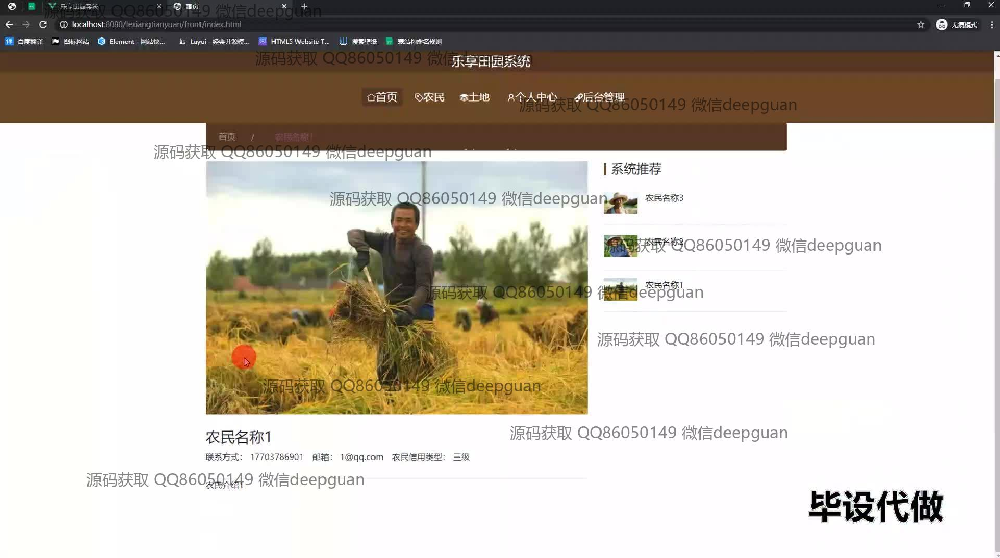
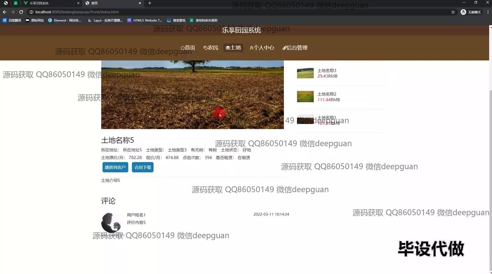
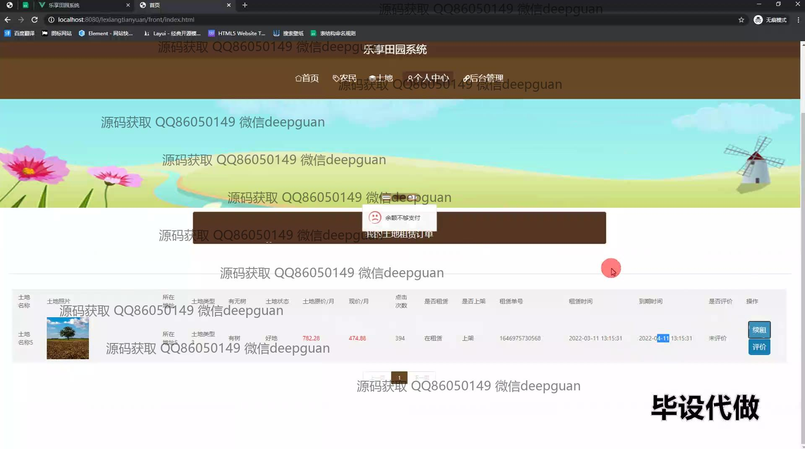
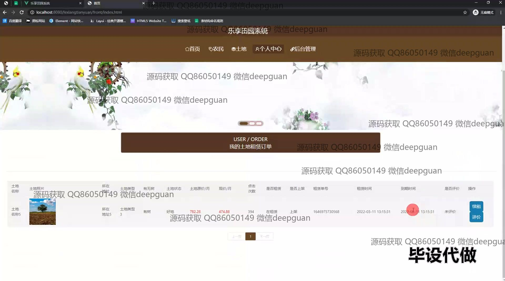
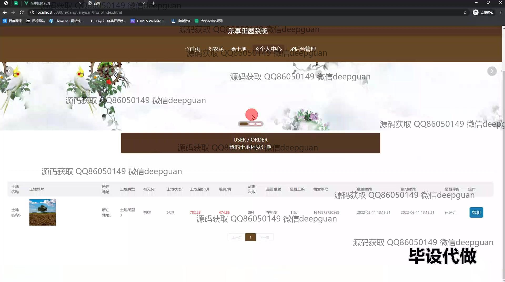
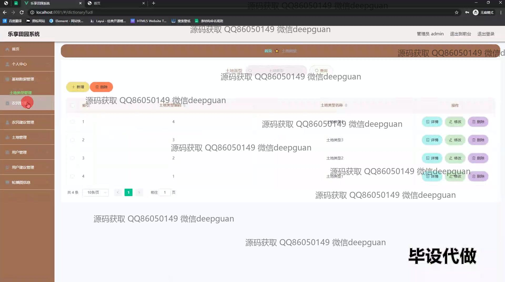
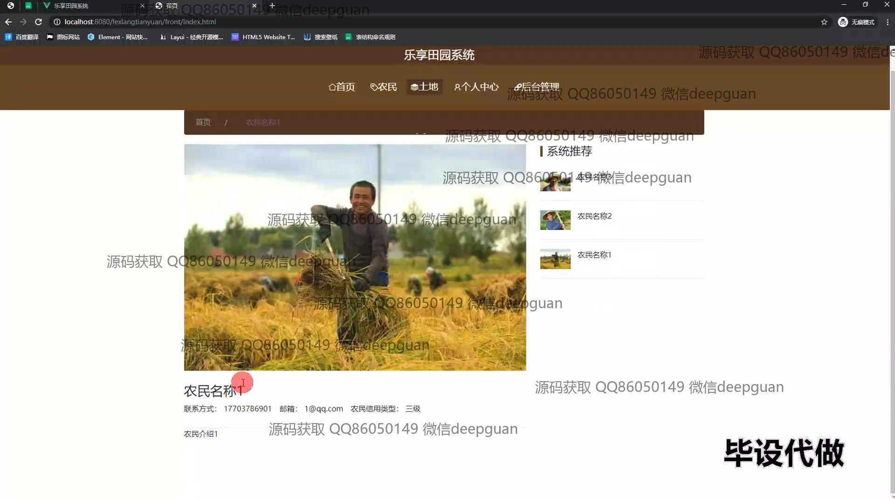
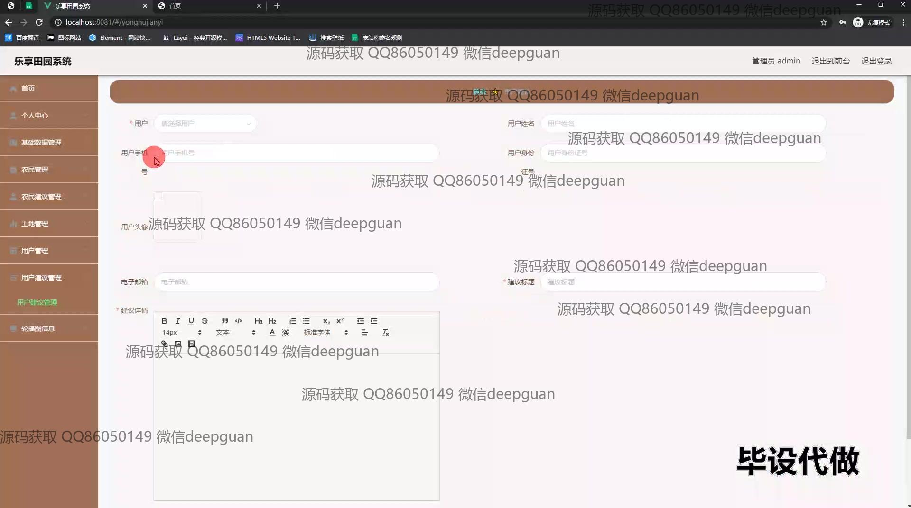
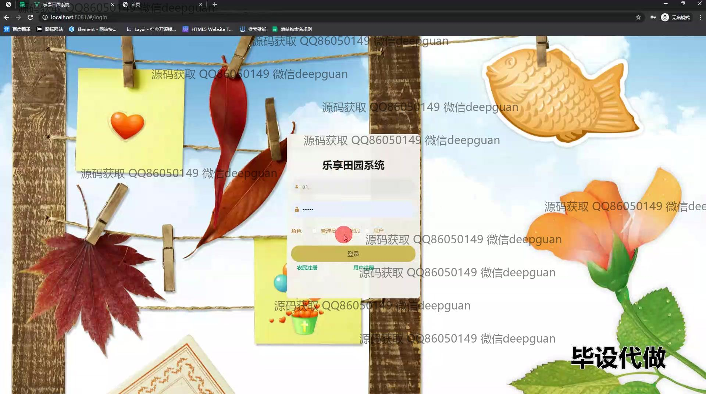
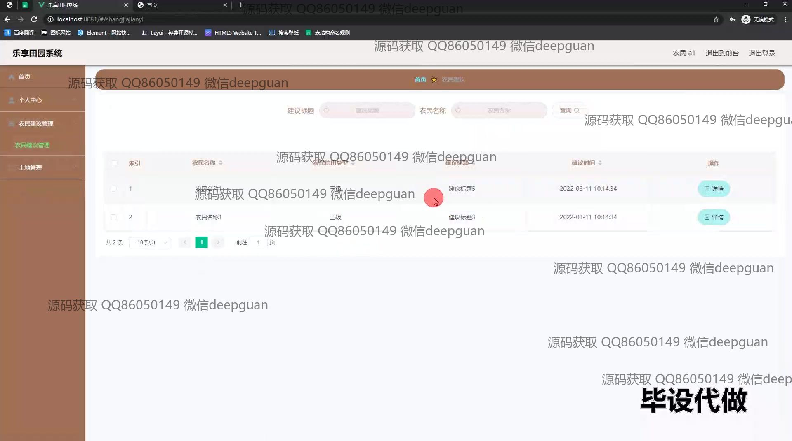
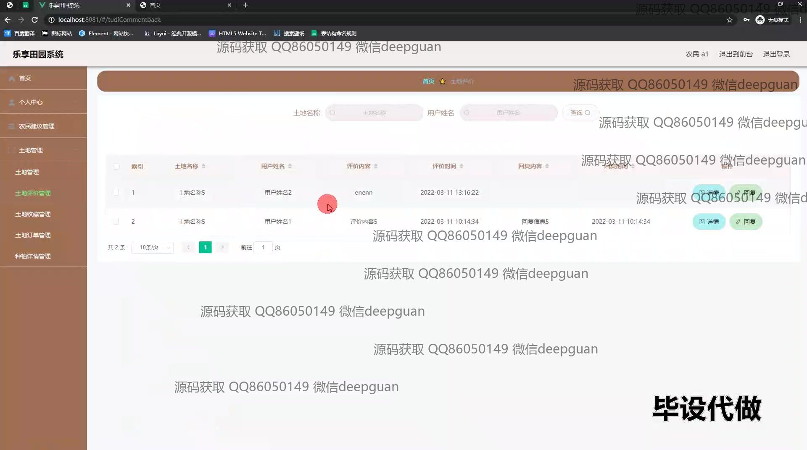
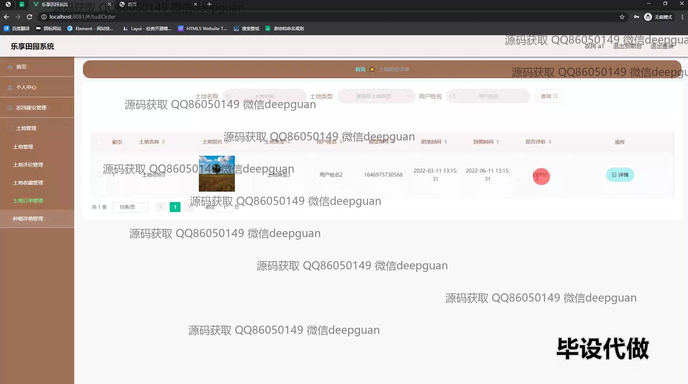
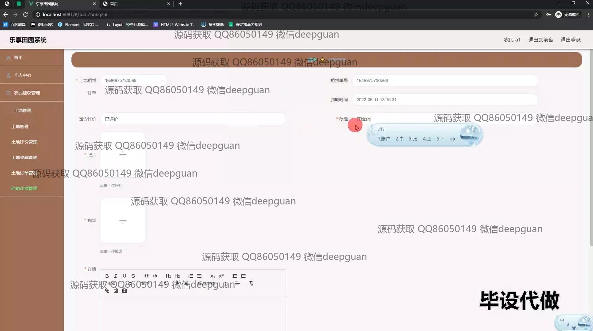
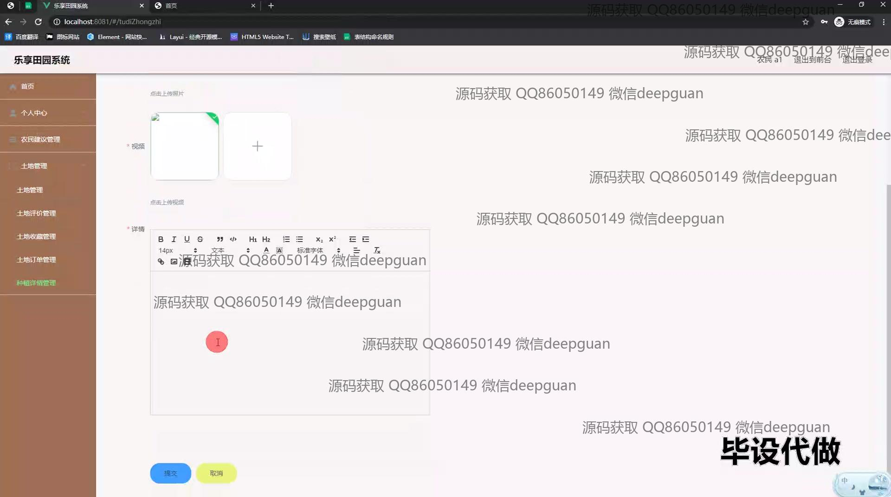
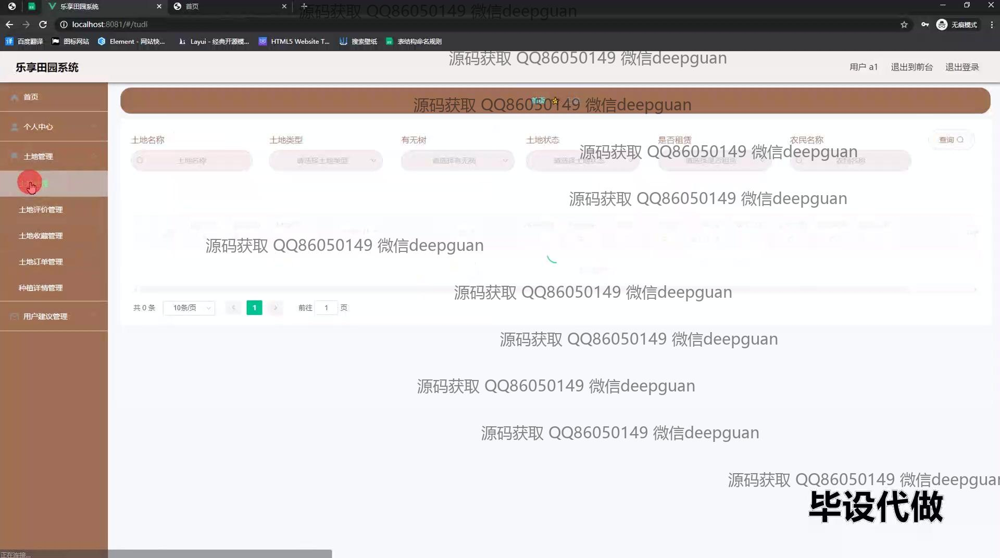
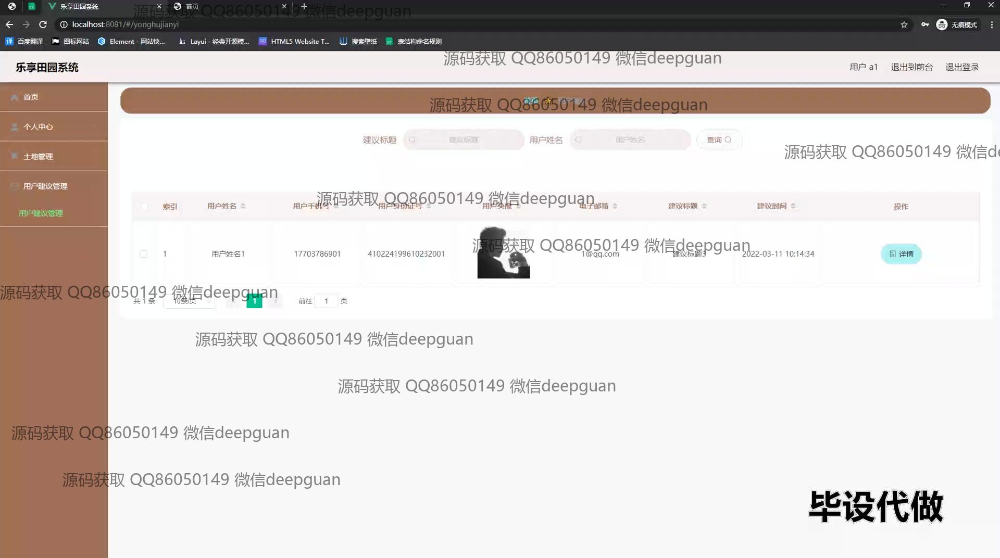

本代码来源于网络,仅供学习参考使用!

